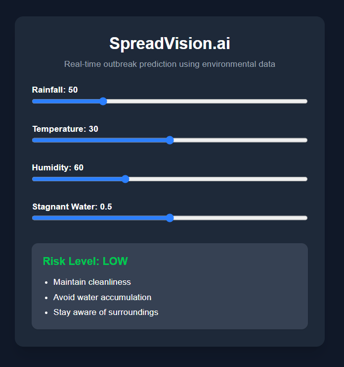

# 🌍 SpreadVision.ai

> 🚀 AI-powered early warning system for disease outbreaks  
> Predicting outbreaks before they happen.

---

## 🔗 Live Demo

🌐 Frontend: https://spreadvision-ai.vercel.app/  
⚡ Backend API: https://spreadvision-aihttps-github-com.onrender.com  

---

## 📸 Preview



---

## 🧠 About the Project

## 🚨 Why This Matters

Every year, diseases like dengue and malaria affect millions of people.

Traditional systems are reactive and respond only after outbreaks begin.

👉 SpreadVision.ai changes this by:

- 🔍 Detecting risk early  
- ⚡ Enabling real-time decisions  
- 🛡️ Providing preventive actions  

➡️ Turning data into prevention

## ⚙️ How It Works

1. 📊 User inputs environmental data:
   - Rainfall
   - Temperature
   - Humidity
   - Stagnant Water Level

2. 🤖 AI Model (XGBoost) analyzes patterns

3. ⚠️ System predicts:
   - LOW
   - MEDIUM
   - HIGH risk

4. 🛡️ Provides preventive actions

5. 🎮 Real-time simulation (What-if analysis)

---

## ✨ Key Features

🔥 Real-time AI Predictions  
📈 Interactive What-If Simulator  
🧠 Machine Learning Model (XGBoost)  
🛡️ Preventive Action Engine  
🌐 Full Stack Deployment (React + FastAPI)  
⚡ Instant UI updates  

---

## 🧪 Tech Stack

### Frontend
- Next.js (React)
- Tailwind CSS
- Axios

### Backend
- FastAPI (Python)
- Uvicorn

### Machine Learning
- Scikit-learn
- XGBoost
- Pandas / NumPy

---

## 🏗️ Project Structure
Spreadvision-ai/
│
├── backend/
│ ├── main.py
│ ├── model/
│ ├── data/
│ └── requirements.txt
│
├── frontend/
│ ├── app/
│ ├── public/
│ └── package.json
│
└── README.md


---

## 🚀 Installation (Local Setup)

### Backend

```bash
cd backend
pip install -r requirements.txt
uvicorn main:app --reload

-------Frontend-------
cd frontend
npm install
npm run dev

🎯 Problem Statement

Traditional systems respond after outbreaks occur.

👉 SpreadVision.ai solves this by:

Predicting outbreaks early

Providing actionable insights

Allowing real-time scenario simulation

🌍 Real-World Impact

🏥 Public Health Monitoring

🏙️ Smart City Systems

🌾 Rural Healthcare Awareness

🧑‍⚕️ NGO & Government Usage

🏆 Why This Project Stands Out

✔ Prediction + Prevention (not just dashboard)
✔ Interactive simulation
✔ Real-world applicability
✔ Fully deployed system

## 👨‍💻 Author

**Shakti Dey**  
🚀 AI/ML Developer | Full Stack Builder  

- Passionate about solving real-world problems using AI  
- Built SpreadVision.ai for proactive healthcare innovation  
⭐ Support

If you like this project:

⭐ Star this repo
🚀 Share it
💡 Build on it
